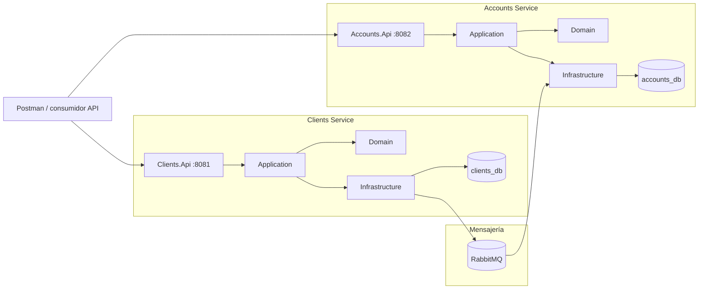

# Banking Microservices

API bancaria desarrollada en **.NET 8** con dos microservicios independientes: uno para clientes y otro para cuentas, movimientos y reportes. La solución aplica separación por capas, persistencia con PostgreSQL y comunicación asíncrona mediante RabbitMQ.

El repositorio incluye el código fuente, base de datos reproducible, pruebas automatizadas, Docker Compose, scripts de verificación y una colección Postman lista para ejecutar.

## Stack técnico

- .NET 8 / ASP.NET Core
- Entity Framework Core 8 + Npgsql
- PostgreSQL 16
- RabbitMQ
- Docker Compose
- xUnit
- Testcontainers
- Coverlet + ReportGenerator
- Postman

## Arquitectura



Cada microservicio mantiene su propia base de datos. `Clients` publica cambios mediante **Outbox + RabbitMQ** y `Accounts` consume los eventos usando **Inbox** para evitar procesamientos duplicados. No existe acceso directo entre las bases de ambos servicios.

La solución está dividida en `Domain`, `Application`, `Infrastructure` y `Api`, con repositorios y dependencias orientadas hacia el dominio.

## Estructura principal

```text
BankingMicroservices/
├─ BankingMicroservices.sln
├─ BaseDatos.sql
├─ docker-compose.yml
├─ postman/
│  └─ BankingMicroservices.postman_collection.json
├─ src/
│  ├─ BuildingBlocks/Banking.Contracts/
│  └─ Services/
│     ├─ Clients/
│     └─ Accounts/
├─ tests/
├─ scripts/
│  ├─ verify.ps1 / verify.sh
│  ├─ coverage.ps1 / coverage.sh
│  └─ smoke.ps1 / smoke.sh
└─ docs/
```

## Requisitos

Antes de ejecutar el proyecto se necesita:

- **.NET SDK 8** (el repositorio fija `8.0.425` mediante `global.json`)
- **Docker Desktop** o Docker Engine con Docker Compose
- **Postman 9.13.2 o superior**
- Puertos libres: `5432`, `5672`, `15672`, `8081`, `8082`

Verificación rápida:

```powershell
dotnet --version
docker --version
docker compose version
```

El SDK está fijado mediante `global.json` para que compilaciones locales y CI utilicen la misma línea de herramientas de .NET 8. La solución compila con **C# 12**, evitando que versiones más nuevas del compilador modifiquen la resolución de sobrecargas en expresiones LINQ destinadas a EF Core 8.

## Descarga y preparación

Descargue o clone el repositorio y abra una terminal en su raíz:

```powershell
cd BankingMicroservices
```

En Windows, si PowerShell bloquea los scripts descargados:

```powershell
Unblock-File .\scripts\verify.ps1
Unblock-File .\scripts\coverage.ps1
Unblock-File .\scripts\smoke.ps1
```

Restaure dependencias si desea compilar manualmente:

```powershell
dotnet restore BankingMicroservices.sln
```

## Validación del código

El script `verify.ps1` restaura dependencias, compila en `Release`, verifica Docker, ejecuta las suites de pruebas y valida la configuración de Compose.

```powershell
.\scripts\verify.ps1
```

También puede ejecutarse manualmente:

```powershell
dotnet build BankingMicroservices.sln -c Release
dotnet test BankingMicroservices.sln -c Release --no-build
```

La suite contiene **34 pruebas automatizadas** distribuidas entre dominio, aplicación, API, PostgreSQL y comunicación entre microservicios.

## Ejecución con Docker

Para iniciar desde un estado limpio y volver a aplicar `BaseDatos.sql`:

```powershell
docker compose down -v --remove-orphans
docker compose build --no-cache
docker compose up -d
docker compose ps
```

> `down -v` elimina el volumen de PostgreSQL. Úselo cuando necesite reinicializar los datos del seed.

Servicios disponibles:

| Servicio | URL |
|---|---|
| Clients API | http://localhost:8081 |
| Swagger Clients | http://localhost:8081/swagger |
| Accounts API | http://localhost:8082 |
| Swagger Accounts | http://localhost:8082/swagger |
| RabbitMQ Management | http://localhost:15672 |
| PostgreSQL | localhost:5432 |

Credenciales locales:

- PostgreSQL: `postgres / postgres`
- RabbitMQ: `banking / banking`

Compruebe el stack después del arranque:

```powershell
.\scripts\smoke.ps1
```

El smoke test consulta readiness y operaciones básicas de ambos servicios.

## Reglas y validaciones de datos

Los identificadores técnicos (`clienteId`, `cuentaId`, `movimientoId`) son **UUID** generados por la aplicación o durante la carga inicial.

Los identificadores de negocio se conservan como `string`, ya que no representan cantidades y pueden requerir ceros a la izquierda.

| Campo | Regla |
|---|---|
| Nombre | obligatorio, máximo 150 caracteres |
| Género | obligatorio, máximo 30 caracteres |
| Edad | entre 0 y 130 |
| Identificación | **exactamente 10 dígitos**, única |
| Dirección | obligatoria, máximo 250 caracteres |
| Teléfono | obligatorio, máximo 30 caracteres |
| Contraseña | mínimo 4 caracteres |
| Número de cuenta | **exactamente 6 dígitos**, único |
| Tipo de cuenta | `Ahorros` o `Corriente` |
| Saldo inicial | mayor o igual a 0 |
| Cliente de una cuenta | debe existir y estar activo |

Las reglas críticas se aplican en más de un nivel:

1. **API/DTO**: validación temprana del payload mediante Data Annotations.
2. **Dominio**: invariantes protegidas por las entidades.
3. **Persistencia**: longitudes, unicidad y `CHECK` constraints en PostgreSQL.

Esto evita depender exclusivamente de la entrada HTTP para conservar datos válidos.

## Datos iniciales

`BaseDatos.sql` crea las dos bases y carga tres clientes y cuatro cuentas. Los UUID se generan en cada inicialización; los datos de negocio permanecen constantes.

| Cliente | Identificación | Cuenta | Tipo | Saldo inicial |
|---|---|---|---|---:|
| Jose Lema | `1100000001` | `478758` | Ahorros | 2000 |
| Marianela Montalvo | `1100000002` | `225487` | Corriente | 100 |
| Juan Osorio | `1100000003` | `495878` | Ahorros | 0 |
| Marianela Montalvo | `1100000002` | `496825` | Ahorros | 540 |

El script utiliza identificaciones de 10 dígitos y números de cuenta de 6 dígitos, las mismas reglas aplicadas a nuevos registros.

## Endpoints

### Clientes — `http://localhost:8081`

| Método | Endpoint | Descripción |
|---|---|---|
| GET | `/api/clientes` | Lista clientes |
| GET | `/api/clientes/{id}` | Consulta un cliente |
| POST | `/api/clientes` | Crea un cliente |
| PUT | `/api/clientes/{id}` | Actualiza un cliente |
| PATCH | `/api/clientes/{id}/estado` | Activa o desactiva un cliente |
| DELETE | `/api/clientes/{id}` | Elimina un cliente |

### Cuentas — `http://localhost:8082`

| Método | Endpoint | Descripción |
|---|---|---|
| GET | `/api/cuentas` | Lista cuentas |
| GET | `/api/cuentas/{id}` | Consulta una cuenta |
| POST | `/api/cuentas` | Crea una cuenta |
| PUT | `/api/cuentas/{id}` | Actualiza una cuenta |
| PATCH | `/api/cuentas/{id}/estado` | Cambia el estado de una cuenta |

### Movimientos — `http://localhost:8082`

| Método | Endpoint | Descripción |
|---|---|---|
| GET | `/api/movimientos` | Lista movimientos; admite filtros |
| GET | `/api/movimientos/{id}` | Consulta un movimiento |
| POST | `/api/movimientos` | Registra depósito o retiro |
| PUT | `/api/movimientos/{id}` | Actualiza un movimiento y recalcula saldo |

Un valor positivo representa un depósito y uno negativo un retiro. Un retiro que exceda el saldo disponible responde `409 Conflict` con `Saldo no disponible`.

### Reportes

```http
GET /api/reportes?fecha=2022-02-01,2022-02-28&cliente=Marianela%20Montalvo
```

También se acepta:

```http
GET /api/reportes?fechaInicio=2022-02-01&fechaFin=2022-02-28&cliente=Marianela%20Montalvo
```

El reporte devuelve cuentas asociadas, saldo inicial, saldo disponible y movimientos del período.

## Colección Postman

La colección se encuentra en:

```text
postman/BankingMicroservices.postman_collection.json
```

**Banking Microservices API** contiene **44 requests** organizados en Estado del servicio, Clientes, Cuentas, Movimientos, Reportes y Cierre. Utiliza variables de colección, por lo que no requiere configurar un Environment adicional.

Para ejecutar el escenario completo de forma reproducible:

```powershell
docker compose down -v --remove-orphans
docker compose up -d
.\scripts\smoke.ps1
```

Después importe la colección y ejecute **Run collection** desde el primer request. El orden es intencional: primero se descubren los UUID dinámicos del seed, luego se crean los recursos temporales, se ejecutan reglas de negocio y movimientos, se consultan reportes y finalmente se realizan las comprobaciones de cierre.

La colección administra automáticamente los datos variables:

- `testClientIdentification`: identificación numérica de 10 dígitos. `Crear cliente` genera un valor nuevo antes de cada envío.
- `testAccountNumber`: número de cuenta de 6 dígitos. `Crear cuenta de prueba` genera un valor nuevo antes de cada envío.
- UUID del seed: se consultan desde las APIs usando las identificaciones y números de cuenta conocidos; no están codificados en el archivo.
- UUID temporales: se guardan desde las respuestas `201 Created` y se reutilizan en consultas, actualizaciones y cambios de estado posteriores.

`Crear cliente` puede ejecutarse directamente después de importar la colección porque inicializa su identificación antes del envío. Los requests que consultan, modifican o eliminan recursos temporales dependen naturalmente de que el recurso haya sido creado; esa dependencia se indica en la descripción de cada request.

Los casos negativos mantienen válidos todos los campos excepto la regla que se desea comprobar. De esta forma, un `400`, `409` o `422` se atribuye a la condición bajo prueba y no a datos auxiliares inválidos.

La colección cubre, entre otros escenarios, identificación inválida, contraseña corta, número de cuenta inválido, tipo de cuenta incorrecto, saldo inicial negativo, duplicados, saldo insuficiente y movimiento con valor cero.

## Pruebas y cobertura

Distribución de la suite:

| Proyecto | Pruebas | Alcance |
|---|---:|---|
| `Clients.Domain.Tests` | 6 | invariantes de Cliente/Persona |
| `Clients.Application.Tests` | 4 | servicio, hashing y eventos |
| `Clients.Api.IntegrationTests` | 6 | HTTP + PostgreSQL + Outbox |
| `Accounts.Domain.Tests` | 11 | cuenta, saldos y movimientos |
| `Accounts.IntegrationTests` | 5 | PostgreSQL, transacciones y concurrencia |
| `Banking.Messaging.IntegrationTests` | 2 | RabbitMQ + PostgreSQL + ambos servicios |
| **Total** | **34** | |

Generar cobertura:

```powershell
.\scripts\coverage.ps1
```

Abrir el reporte:

```powershell
Start-Process .\coverage-report\index.html
```

El reporte se genera a partir de las seis suites para evitar mantener porcentajes manuales desactualizados en la documentación.

## Integración continua

El workflow `.github/workflows/ci.yml` ejecuta en cada `push` a `main`/`master` y en cada pull request:

1. preparación del SDK definido en `global.json`;
2. restore y build en `Release`;
3. comprobación del daemon Docker requerido por Testcontainers;
4. ejecución de las 34 pruebas con cobertura;
5. generación del reporte Cobertura/HTML;
6. publicación de resultados y cobertura como artifact de GitHub Actions.

Las Actions utilizadas ejecutan sobre Node.js 24 y el SDK de compilación queda fijado en .NET 8 para mantener el mismo comportamiento entre desarrollo local y CI.

## Flujo recomendado de validación

```text
restore / build
      ↓
pruebas automatizadas
      ↓
reporte de cobertura
      ↓
Docker Compose
      ↓
readiness + smoke
      ↓
Postman Collection Runner
```

Este flujo valida por separado compilación, reglas de dominio, persistencia, mensajería, despliegue y comportamiento HTTP.

## Documentación adicional

- [`docs/DECISIONES_TECNICAS.md`](docs/DECISIONES_TECNICAS.md): arquitectura y decisiones de diseño.
- [`docs/PRUEBAS.md`](docs/PRUEBAS.md): alcance y ejecución de pruebas.
- [`docs/POSTMAN.md`](docs/POSTMAN.md): ejecución de la colección.
- [`docs/DATOS_INICIALES.md`](docs/DATOS_INICIALES.md): seed y UUID dinámicos.
- [`docs/TRAZABILIDAD.md`](docs/TRAZABILIDAD.md): relación entre requisitos e implementación.
